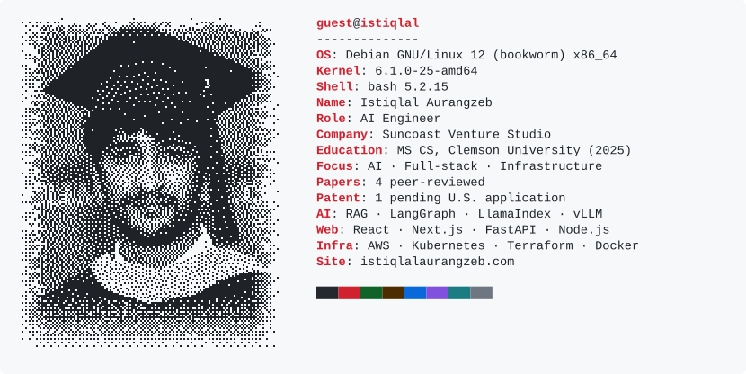

```console
$ ssh guest@istiqlalaurangzeb.com
   _     __  _      __     __                                       __
  (_)__ / /_(_)__ _/ /__ _/ / ___ ___ _________ ____  ___ ____ ___ / /
 / (_-</ __/ / _ `/ / _ `/ / / _ `/ // / __/ _ `/ _ \/ _ `/_ // -_) _ \
/_/___/\__/_/\_, /_/\_,_/_/  \_,_/\_,_/_/  \_,_/_//_/\_, //__/\__/_.__/
              /_/                                   /___/

guest@istiqlalaurangzeb.com's password:
Linux istiqlal 6.1.0-25-amd64 #1 SMP Debian 6.1.106-3 x86_64

The programs included with the Debian GNU/Linux system are free software;
the exact distribution terms for each program are described in the
individual files in /usr/share/doc/*/copyright.

guest@istiqlal:~$ neofetch
```

<a href="https://www.istiqlalaurangzeb.com/">
  <picture>
    <source media="(prefers-color-scheme: dark)" srcset="./assets/neofetch-dark.svg">
    
  </picture>
</a>

[`email`](mailto:istiqlal1234@gmail.com) [`linkedin`](https://www.linkedin.com/in/istiqlalbhat) [`scholar`](https://scholar.google.com/citations?user=v4-8HccAAAAJ) [`site`](https://www.istiqlalaurangzeb.com/)

```console
guest@istiqlal:~$ ls -F
about.txt  patents.txt  principles.txt  publications.txt  stack/
```

```console
guest@istiqlal:~$ cat about.txt
I'm an AI engineer at Suncoast Venture Studio. I build AI features such
as RAG pipelines and agents, and I work across the full stack to ship
them, from backend APIs to web and mobile frontends. I also handle the
infrastructure side: containerizing services with Docker, deploying them
on Kubernetes, managing AWS resources with Terraform, and setting up
CI/CD with GitHub Actions.

I like owning projects end to end, from the database schema to the
interface people use, and I care about how they perform and hold up
after launch.

I hold an MS in Computer Science from Clemson University (December
2025). At Clemson, I worked as a research software developer, building
AI- and blockchain-based systems for the construction industry,
including a carbon emissions ledger and an automated procurement system
that removes relationship bias from bid evaluation. That research led to
four peer-reviewed publications and a pending U.S. patent application.
```

```console
guest@istiqlal:~$ tree ~/stack
~/stack
├── ai .............. PyTorch · Hugging Face · LangGraph · LlamaIndex
│                     Ragas · LangSmith · Weights & Biases
│                     scikit-learn
├── llmops .......... vLLM · Ollama · llama.cpp · ONNX Runtime
│                     TensorRT · Core ML · LoRA/QLoRA · GGUF
├── languages ....... Python · TypeScript · JavaScript · Dart · Swift
│                     C# · C++ · SQL
├── frontend ........ React · Next.js · Tailwind CSS · Framer Motion
│                     GLSL · WebGPU
├── mobile .......... Flutter · Expo · React Native · Riverpod
│                     EAS Build
├── backend ......... Node.js · FastAPI · Django/DRF · Fastify · GraphQL
│                     gRPC · Celery · Drizzle ORM · Gunicorn
├── data ............ PostgreSQL · pgvector · Pinecone · ChromaDB
│                     Redis · Supabase · Firebase · Better Auth
├── infrastructure .. AWS · Kubernetes · Terraform · Docker
│                     GitHub Actions · LocalStack
├── blockchain ...... Solidity · Hardhat · ethers.js · Web3.js
└── testing ......... pytest · Vitest · Playwright

10 directories, 65 files
```

```console
guest@istiqlal:~$ cat principles.txt
→ Start with a working version, then let real usage guide the next
  iteration.
→ Keep the architecture simple enough to change as requirements evolve.
→ Measure success by latency, uptime, and user retention.
→ Harden what people depend on with tests, monitoring, and clear
  documentation.
```

```console
guest@istiqlal:~$ cat publications.txt
[1] 2026  Transformational emissions accounting system using BIM- and
          blockchain-enabled smart contracts for building structural
          materials
          J. H. Yoon, I. Aurangzeb
          Architectural Engineering and Design Management (T&F), vol. 22
          doi:10.1080/17452007.2026.2632102

[2] 2026  Advancing Active Shooter Evacuation Systems in the Built
          Environment: A Systematic Review and Future Directions
          J. H. Yoon, S. R. Arshid, I. Aurangzeb
          Advances in Science and Technology (Trans Tech), vol. 173
          doi:10.4028/p-oG7g3d

[3] 2025  Artificial intelligence- and blockchain-enabled carbon
          emissions ledger system (AB-CELS) for sustainable construction
          processes
          I. Aurangzeb, J. H. Yoon
          Automation in Construction (Elsevier), vol. 176
          doi:10.1016/j.autcon.2025.106286

[4] 2024  BIM- and blockchain-enabled Automatic Procurement System
          (BBAPS) removing relationship bias
          J. H. Yoon, I. Aurangzeb, S. McNamara
          Automation in Construction (Elsevier), vol. 168
          doi:10.1016/j.autcon.2024.105779
```

[`open [1]`](https://doi.org/10.1080/17452007.2026.2632102) [`open [2]`](https://doi.org/10.4028/p-oG7g3d) [`open [3]`](https://doi.org/10.1016/j.autcon.2025.106286) [`open [4]`](https://doi.org/10.1016/j.autcon.2024.105779)

```console
guest@istiqlal:~$ cat patents.txt
[pending]  US 2026/0099817 A1
           Immutable ledger enabled automatic procurement system
           Blockchain smart contracts that keep subcontractor identities
           anonymous while bids are evaluated.
           Inventors: Sean McNamara, Istiqlal Aurangzeb, Jong Han Yoon
```

[`open patent`](https://patents.google.com/patent/US20260099817A1/en)

```console
guest@istiqlal:~$ git log --graph
```

<picture>
  <source media="(prefers-color-scheme: dark)" srcset="https://raw.githubusercontent.com/istiqlalbhat/istiqlalbhat/output/github-contribution-grid-snake-dark.svg" />
  <source media="(prefers-color-scheme: light)" srcset="https://raw.githubusercontent.com/istiqlalbhat/istiqlalbhat/output/github-contribution-grid-snake.svg" />
  
</picture>

```console
guest@istiqlal:~$ cat ~istiqlal/.plan
If you're building something interesting, let's talk.

guest@istiqlal:~$ exit
logout
Connection to istiqlalaurangzeb.com closed.
```
