```mermaid
graph TD
    A[🎓 MS Computer Science] --> B[🔬 Research Assistant]
    B --> C[📝 2 Published Papers]
    B --> D[⛓️ Smart Contract Dev]
    B --> E[🤖 AI/ML Integration]
    C --> F[🏆 Impact Factor: 9.6]
```

```markdown
 Hey there, I'm Istiqlal Aurangzeb!

<div align="center">
  
</div>

<div align="center">
  
  
  
</div>

<br>

<div align="center">
  <a href="mailto:istiqlal1234@gmail.com">
    
  </a>
  <a href="https://www.linkedin.com/in/istiqlalaurangzeb">
    
  </a>
  <a href="https://scholar.google.com/citations?user=v4-8HccAAAAJ">
    
  </a>
</div>

##  About Me


- 🎓 **MS in Computer Science** at Clemson University (Dec 2025)
- 🔬 **Graduate Research Assistant** building cutting-edge blockchain solutions
- 📝 **Published Author** in Automation in Construction (Impact Factor: 9.6)
- 🚀 Passionate about **Web3**, **AI/ML**, and **Full-Stack Development**
- 🌱 Currently exploring **Large Language Models** and **Smart Contract Security**
- ⚡ Fun fact: I've audited 2.4K lines of Solidity code with 0 critical vulnerabilities!

<br clear="right"/>

##  Tech Stack

<div align="center">

### 👨‍💻 Programming Languages
<p>
  
  
  
  
  
  
</p>

### 🌐 Web Development
<p>
  
  
  
  
  
</p>

### ⛓️ Blockchain & Web3
<p>
  
  
  
  
</p>

### 🛠️ Tools & Technologies
<p>
  
  
  
  
  
  
</p>

</div>

##  GitHub Stats

<div align="center">
  
  
</div>

<div align="center">
  
</div>

##  Achievements

<div align="center">
  
</div>

##  Recent Activity

<!--START_SECTION:activity-->

<!--END_SECTION:activity-->

##  Publications

<div align="center">

[-blue?style=for-the-badge&logo=elsevier&logoColor=white)](https://doi.org/10.1016/j.autcon.2025.105987)

[-green?style=for-the-badge&logo=elsevier&logoColor=white)](https://doi.org/10.1016/j.autcon.2024.105779)

</div>

##  Random Dev Quote

<div align="center">
  
</div>

---

<div align="center">
   <b>Let's connect and build something amazing together!</b>
  
  <br><br>
  
  
</div>
```
